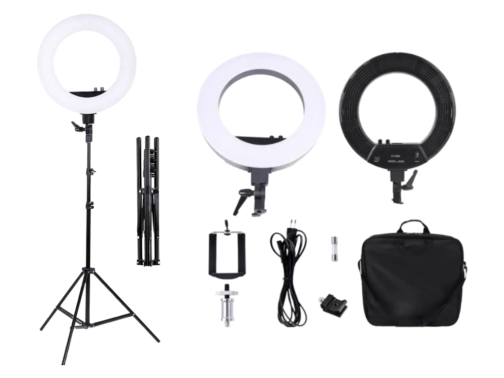
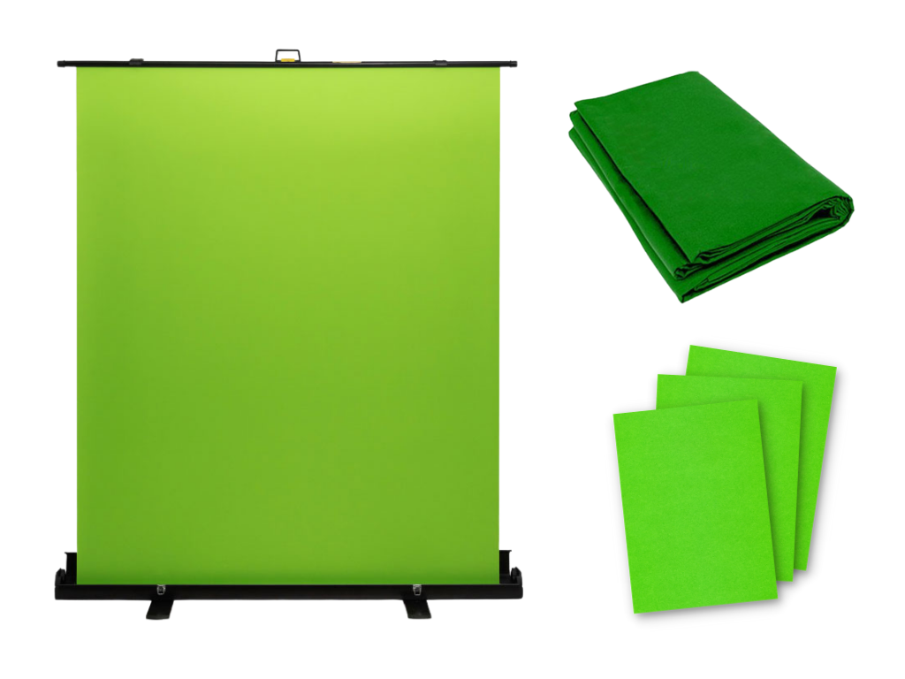

# แนะนำชุดอุปกรณ์ CMU EZ Studio

           ศูนย์นวัตกรรมการสอนและการเรียนรู้ ได้ให้บริการผลิตสื่อในรูปแบบ Video Streaming โดยใช้เครื่องมือและซอฟต์แวร์ช่วยในการผลิต ซึ่งในปัจจุบันด้วยความก้าวหน้าทางเทคโนโลยีทำให้คณาจารย์สามารถผลิตสื่อด้วยตนเองได้จากทุกสถานที่ ทางศูนย์นวัตกรรมการสอนและการเรียนรู้ จึงขอนำเสนอชุดอุปกรณ์ที่จะช่วยให้การสร้างสื่อการเรียนการสอนให้เป็นเรื่องง่ายและเป็นสื่อที่มีคุณภาพ 

## ⭐ แนะนำชุดอุปกรณ์ CMU EZ Studio 2021 \(ล่าสุด\)



## **ภายในชุด CMU** EZ Studio ประกอบด้วยอุปกรณ์ดังนี้

### 1.เครื่องคอมพิวเตอร์ คุณภาพสูง 

         ในชุดอุปกรณ์ของ CMU EZ Studio นั้น  TLIC เลือกใช้ Computer Notebook ยี่ห้อ **Acer รุ่น Nitro 5** ที่มีคุณภาพสูง สามารถรองรับการใช้งานด้านกราฟฟิกได้เป็นอย่างดี 

          อย่างไรก็ตามท่านสามารถใช้คอมพิวเตอร์ หรือ Laptop คุณภาพสูงที่มี Spec ขั้นต่ำได้ดังนี้

#### **Specification**

| หัวข้อ | รายละเอียด |
| :--- | :--- |
| OS | Windows 10  |
| Processor | Intel Core i5 10300H |
| LOD | 15.6" FHD IPS 144Hz slim bezel LCD |
| Graphic | NVIDIA GeForce RTX 2060 with 6 GB GDDR6 Dedicated VRAM |
| Memory  | 16 GB DDR4 2933MHz Memory |
| Storage | 512 GB PCle NVMe SSD\* |
| Battery | 57Wh Li-ion baterry |

### 2.กล้อง Webcam และ ขาตั้งกล้อง

          ในชุดอุปกรณ์ของ CMU EZ Studioนั้น TLIC เลือกใช้กล้องเว็บแคม **Logitech C922 Pro Anchor webcam** ซึ่งเป็นกล้องเว็บแคมที่เป็นที่นิยมและมีความสามารถในการบันทึกภาพที่มีคุณภาพ

           อย่างไรก็ตามท่านสามารถใช้กล้อง webcam ที่มี Spec ขั้นต่ำดังนี้

#### **Specification**

| หัวข้อ | รายละเอียด |
| :--- | :--- |
| Video playback & recording | 1080p30fps/720p60fps/720p30fps |
| Video Call | 1080P Full HD |
| Focus on | auto focus |
| Microphone | stereo |
| Background delete | yes |
| tripod | yes |
| H.264 coding | yes |



### 3.ไมโครโฟน และ ขาตั้งไมโครโฟน

          ในชุดอุปกรณ์ของ CMU EZ Studio นั้น TLIC เลือกใช้ไมโครโฟน **Samson Meteor Mic USB Studio Condenser Microphone** ที่มีความสามารถในการบันทึกเสียงและปรับความถี่เสียงเพื่อคุณภาพที่ดีของเสียง ใช้งานง่ายและ ติดตั้งง่าย 

          อย่างไรก็ตามท่านสามารถใช้ไมโครโฟน ที่มี Spec ขั้นต่ำดังนี้ 

#### **Specification**

| หัวข้อ | รายละเอียด |
| :--- | :--- |
| Sound Field | Mono |
| Transducer | Condenser |
| Frequency Range | 20 Hz to 20 kHz |
| Signal to Noise Ratio | 96 dB |
| Maximum SPL | 120 dB SPL RMS |
| Bit Depth | 16-Bit |
| Sample Rate | 44.1 kHz 48 kHz |
| Operating System Support | Windows, macOS/OS X |



### 4.แสงไฟ Ring Light LED

            ในชุดอุปกรณ์ของ CMU EZ Studio นั้น TLIC เลือกใช้ **LD-500 Portable Ring Light \(รุ่นใหม่\)** และ **Ring Light LED CY-R50L \(รุ่นเก่า\)** ซึ่งเป็นอุปกรณ์ที่ให้ความสว่างได้ค่อนข้างมาก 

             อย่างไรก็ตามท่านสามารถใช้แสงไฟ Ring Light ที่มี Spec ขั้นต่ำดังนี้ 

#### **Specification**

| หัวข้อ | รายละเอียด |
| :--- | :--- |
| Voltage | 90-260V |
| Power | 50W  |
| Temperature | 3200-5500K |
| Diameter | 45cm / 18in |
| Item Weight | 1.9kg / 4.2lb |
| PLumens | 6500LUX |
| Flash Index | RA≥90 External |



### 5.เครื่อง EZ Studio Controller 

เครื่อง EZ Studio Controller  Version 3.0 ซึ่งเป็นเวอร์ชันล่าสุดในขณะนี้ ท่านสามารถใช้งานได้ทันทีเพียงเชื่อมต่อเข้ากับคอมพิวเตอร์หรือ Laptop โดยไม่ต้องทำการลงโปรแกรมเหมือนกับ Version 1.0 และ 2.0



### 6.หน้าจอแสดงผล

เพื่อแสดงผลการถ่ายทำสื่อการเรียนการสอน โดยหน้าจอแสดงผลนี้สามารถใช้จอคอมพิวเตอร์ จอ TV หรือจออื่นๆที่ท่านมีอยู่แล้วได้ โดยทำการเชื่อมต่อกับเครืองคอมพิวเตอร์ของท่าน

## อุปกรณ์เสริม \(ไม่ได้รวมอยู่ในชุดอุปกรณ์ CMU EZ STUDIO\)

### 7.Green Screen 

ใช้สำหรับการซ้อนภาพผู้บรรยายบนสื่อที่ต้องการ การเปลี่ยนพื้นหลังเป็นสถานที่ต่างๆ หรือ เปลี่ยนพื้นหลังเป็นสื่อการสอน โดยสามารถใช้แบบสำเร็จรูป หรือประยุกต์ใช้จากผ้าสีเขียว และ กระดาษสีเขียวแทนได้ 

