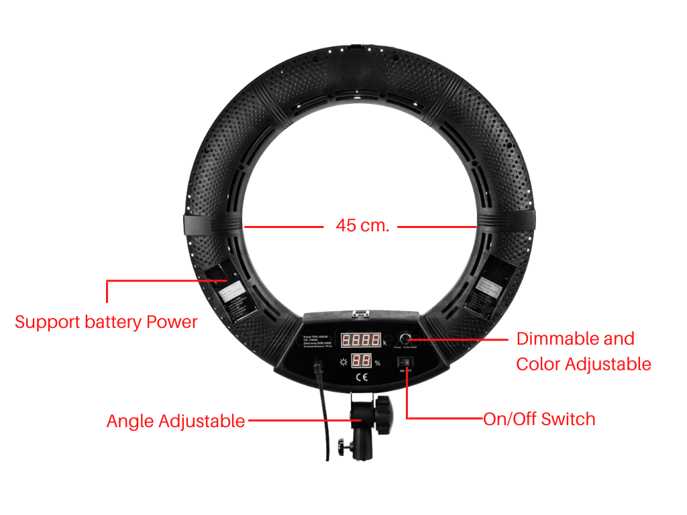
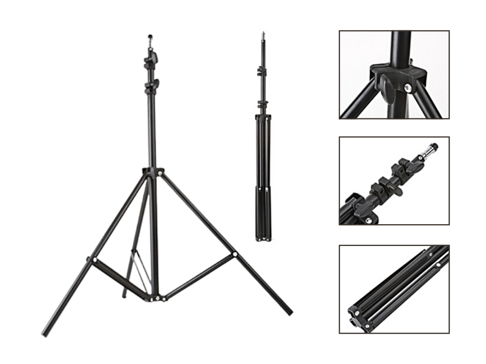

# คู่มือการใช้แสงไฟ Ring Light LED

แสงไฟ Ring Light LED ในชุด EZ Studio นั้น แบ่งเป็น 2 รุ่น ได้แก่ 

1. รุ่นใหม่ คือรุ่น LD-500 Portable Ring light
2. รุ่นเก่า คือรุ่น Ring Light LED CY-R50L

ซึ่งจะมีรายละเอียดการใช้งานในแต่ละรุ่นดังนี้

## LD-500 Portable Ring Light \(รุ่นใหม่\)

          LD-500 Portable Ring light  มีขนาด 50 ซม. รองรับการใช้งาน 2 ระบบ สามารถเสียบสายไฟ หรือ ใช้งานด้วยแบตเตอรี่ได้ มีดีไซต์พิเศษในการกระจายแสงด้วยความมนแบบไร้ขอบ จึงทำให้ได้แสงในวงกว้างกว่า แสงสวยมากกว่าเดิม พร้อมกำลังไฟที่เต็มประสิทธิภาพโดยให้กำลังไฟสูงถึง 96 วัตต์ และ สามารถปรับสีของแสงได้ ไม่ว่าจะเป็นโทนสีอุ่นสีส้ม หรือ โทนสีขาวสว่าง

### รายละเอียดส่วนต่างๆของ LD-500 Portable Ring light \(รุ่นใหม่\)

### วิธีการใช้งาน LD-500 Portable Ring light \(รุ่นใหม่\)

#### 1. กดที่ปุ่ม **ON/OFF** เพื่อเปิดและปิดเครื่อง

   โดยปุ่มนี้จะอยู่บริเวณด้านหลังของตัว Ring Light LED

#### 2. ปรับลดความสว่างของแสงและอุณหภูมิแสงได้ในปุ่มเดียว \(**Dimmable and Color Adjustable\)**

* ปุ่มที่ 1 อยู่บริเวณด้านหน้าของตัว Ring Light LED
* ปุ่มที่ 2 อยู่บริเวณด้านหลังของตัว Ring Light LED

ท่านสามารถหมุนปุ่มปรับนี้เพื่อปรับความสว่างของแสง และ กดอีกครั้งเพื่อปรับอุณหภูมิหรือโทนสีของแสงให้เป็นโทนสีส้มหรือโทนขาวสว่าง

## Ring Light LED CY-R50L \(รุ่นเก่า\)

### รายละเอียดส่วนต่างๆของ Ring Light LED CY-R50L\(รุ่นเก่า\)

ในชุดของ Ring Light LED จะประกอบไปด้วยอุปกรณ์หลายชิ้น โดยให้ท่านทำการประกอบชิ้นส่วนแต่ละส่วนเข้าด้วยกันดังภาพ

รายละเอียดส่วนต่างๆของ Ring Light LED CY-R50L มีดังนี้

### วิธีการใช้งาน Ring Light LED CY-R50L

#### 1. กดที่ปุ่ม **ON/OFF** เพื่อเปิดและปิดเครื่อง

โดยปุ่มนี้จะอยู่บริเวณด้านหลังของตัว Ring Light LED

#### 2. ท่านสามารถปรับลดเพิ่มความแรงของแสงด้วยปุ่มหมุน **Dimmable**

* หมุนปุ่มปรับแสงไปทางขวาเพื่อเพิ่มความสว่างของแสงไฟ
* หมุนปุ่มปรับแสงไปทางซ้ายเพิ่มลดความสว่างของแสงไฟ

#### 3. ปรับอุณหภูมิแสงหรือโทนแสงด้วยปุ่ม **Color Temperature**

* หมุนปุ่มปรับแสงไปทางขวาเพื่อเพิ่มอุณหภมูิของแสงไฟ \(โทนเหลือง-ส้ม\) ซึ่งจะช่วยให้ภาพดูอบอุ่นมากขึ้น
* หมุนปุ่มปรับแสงไปทางซ้ายเพื่อเพิ่มอุณหภมูิของแสงไฟ \(โทนฟ้า\) ซึ่งจะช่วยให้ภาพดูสว่างจ้ามากขึ้น


ปุ่ม FUSE คือปุ่มที่ใช้ป้องกันการช็อต


#### 4. การปรับองศาของแสงไฟ Ring Light LED

ท่านสามารถปรับองศา หรือมุมของไฟให้ก้มหรือเงย รวมถึง หมุนไปทางซ้าย ขวา ได้ เพื่อทำให้เกิดแสงเงาที่ต้องการ โดยปรับที่บริเวณฐานของวงแหวนไฟ Ring Light LED ดังภาพ

## การใช้งานขาตั้งแสงไฟ Ring Light

1. **กางขาตั้งออก** ขาตั้งจะมีฐานจำนวน 3 ขา ให้ท่านกางออกเพื่อให้ขาตั้งนั้นตั้งได้
2. **ปรับระดับความสูงต่ำของขาตั้**ง ท่านสามารถปรับระดับความสูงต่ำของขาตั้งได้โดยการหมุนปุ่มปรับระดับเพื่อคลายความแน่นของขาตั้งในแต่ละส่วนก่อน จากนั้นทำการปรับระดับความสูงต่ำตามต้องการ 
3. **หมุนปุ่มปรับระดับกลับ**เพื่อให้ขาตั้งคงสภาพตามที่ต้องการ

4. การปรับองศาของแสงไฟ Ring Light LED

ท่านสามารถปรับองศา หรือมุมของไฟให้ก้มหรือเงย รวมถึง หมุนไปทางซ้าย ขวา ได้ เพื่อทำให้เกิดแสงเงาที่ต้องการ โดยปรับที่บริเวณฐานของวงแหวนไฟ Ring Light LED ดังภาพ

