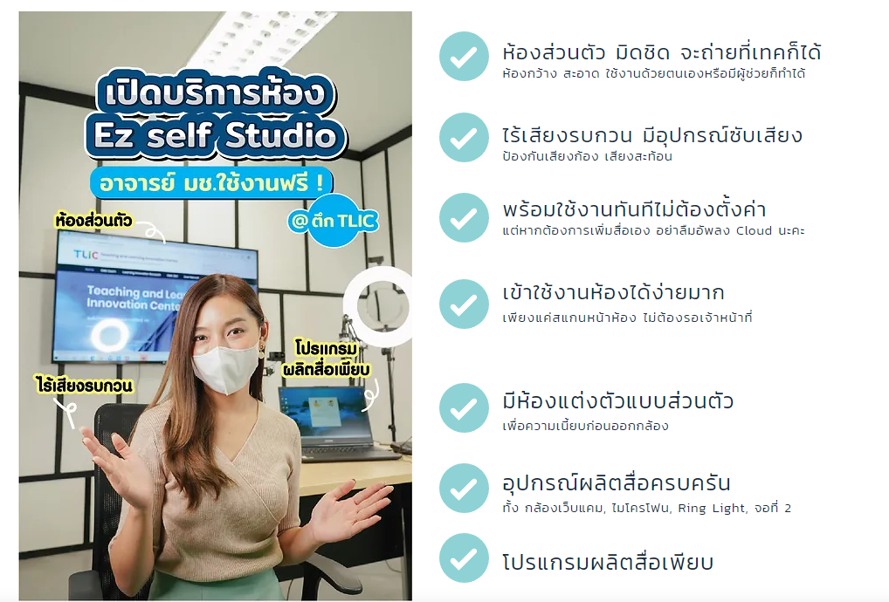

# การเชื่อมอุปกรณ์

การประกอบชุดอุปกรณ์ EZ Studio นั้นมีแนวปฏิบัติดังแสดงในรูปต่อไปนี้

## อุปกรณ์ USB

เนื่องจากช่องเสียบ USB \(แบบ Type A\) บนคอมพิวเตอร์มีเพียง 3 ช่องจำกัด แต่อุปกรณ์ USB ในชุดมี 4 ชิ้น ดังนั้นต้องใช้ USB Hub \(รวมอยู่ในชุด\) เข้ามาช่วยขยายช่องเสียบ ซึ่งโครงการฯ แนะนำให้เลือกเสียบอุปกรณ์ดังนี้

| อุปกรณ์ | ช่องเสียบที่แนะนำ | หมายเหตุ |
| :--- | :--- | :--- |
| Web-cam | เสียบช่อง USB บนเครื่องโดยตรง | ต้องส่งข้อมูลด้วยความเร็วสูง  |
| ไมโครโฟน | เสียบเครื่อง / USB Hub  | เสียบเครื่องโดยตรงได้ก็ดี แต่ถ้าต้องเสียบกับ USB Hub ก็ไม่น่ามีปัญหา |
| EZ Controller | USB Hub | ไม่ได้อาศัยความเร็วสูง  |
| เมาส์ไร้สาย \(ตัวรับสัญญาณ\) | USB Hub | ไม่ได้อาศัยความเร็วสูง |

### 

### 

### 

### 

