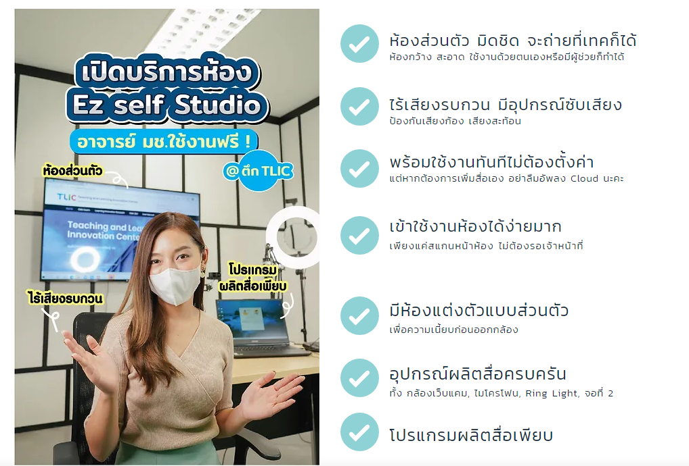

# แนะนำ EZ Series

## EZ Self Studio

บริการ EZ Self Studio เป็นบริการส่วนหนึ่งของทาง TLIC ที่ให้บริการห้องสตูดิโอขนาดเล็กสำหรับอาจารย์ เจ้าหน้าที่ บุคลากร สามารถเข้าจองใช้งานห้องเพื่่อใช้ในการสร้างและผลิตสื่อการเรียนการสอนได้ด้วยตนเอง โดยปัจจุบันมีให้บริการ EZ Self Studio เป็นจำนวน 2 ห้อง

## จองใช้งานห้องทันทีได้[ที่นี่](https://ezbooking.tlic.cmu.ac.th/)

<figure><figcaption></figcaption></figure>

## EZ Active Classroom

ห้องเรียนแบบ Active Learning จำนวน 2 ห้อง สำหรับการเรียนแบบ Onsite หรือ Online ที่มีความแตกต่างกัน

## **เข้าร่วมคอร์สเพื่อผ่านเงื่อนไขและจองใช้งานห้องได้** [**ที่นี่**](https://mango-cmu.instructure.com/enroll/8DBADD)

<figure><figcaption></figcaption></figure>

## EZ Media Studio

ห้องสตูดิโอขนาดใหญ่สำหรับการผลิตสื่อแบบเต็มรูปแบบ **Coming Soon**

<figure><figcaption></figcaption></figure>
