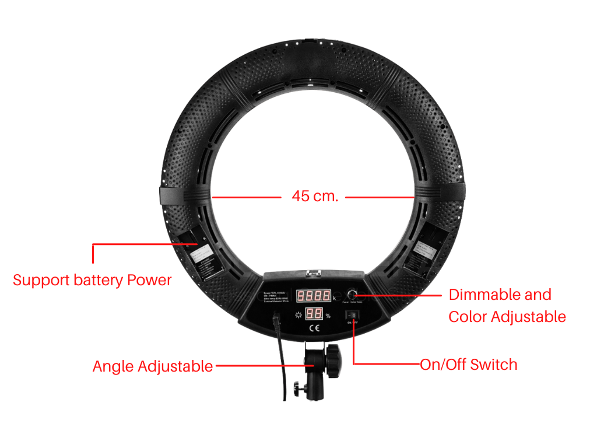

# LD-500 Portable Ring Light (รุ่นใหม่)

## LD-500 Portable Ring light (รุ่นใหม่)

&#x20;         LD-500 Portable Ring light  มีขนาด 50 ซม. รองรับการใช้งาน 2 ระบบ สามารถเสียบสายไฟ หรือ ใช้งานด้วยแบตเตอรี่ได้ มีดีไซน์พิเศษในการกระจายแสงด้วยความมนแบบไร้ขอบ จึงทำให้ได้แสงในวงกว้างกว่า แสงสวยมากกว่าเดิม พร้อมกำลังไฟที่เต็มประสิทธิภาพโดยให้กำลังไฟสูงถึง 96 วัตต์ และ สามารถปรับสีของแสงได้ ไม่ว่าจะเป็นโทนสีอุ่นสีส้ม หรือ โทนสีขาวสว่าง

### รายละเอียดส่วนต่างๆของ LD-500 Portable Ring light (รุ่นใหม่)

.png>)

### วิธีการใช้งาน LD-500 Portable Ring light (รุ่นใหม่)

#### 1. กดที่ปุ่ม **ON/OFF** เพื่อเปิดและปิดเครื่อง

&#x20;  โดยปุ่มนี้จะอยู่บริเวณด้านหลังของตัว Ring Light LED

#### 2. ปรับลดความสว่างของแสงและอุณหภูมิแสงได้ในปุ่มเดียว (**Dimmable and Color Adjustable)**

* ปุ่มที่ 1 อยู่บริเวณด้านหน้าของตัว Ring Light LED
* ปุ่มที่ 2 อยู่บริเวณด้านหลังของตัว Ring Light LED

ท่านสามารถหมุนปุ่มปรับนี้เพื่อปรับความสว่างของแสง และ กดอีกครั้งเพื่อปรับอุณหภูมิหรือโทนสีของแสงให้เป็นโทนสีส้มหรือโทนขาวสว่าง

## การใช้งานขาตั้งแสงไฟ Ring Light

1. **กางขาตั้งออก** ขาตั้งจะมีฐานจำนวน 3 ขา ให้ท่านกางออกเพื่อให้ขาตั้งนั้นตั้งได้
2. **ปรับระดับความสูงต่ำของขาตั้**ง ท่านสามารถปรับระดับความสูงต่ำของขาตั้งได้โดยการหมุนปุ่มปรับระดับเพื่อคลายความแน่นของขาตั้งในแต่ละส่วนก่อน จากนั้นทำการปรับระดับความสูงต่ำตามต้องการ&#x20;
3. **หมุนปุ่มปรับระดับกลับ**เพื่อให้ขาตั้งคงสภาพตามที่ต้องการ

4\. การปรับองศาของแสงไฟ Ring Light LED

ท่านสามารถปรับองศา หรือมุมของไฟให้ก้มหรือเงย รวมถึง หมุนไปทางซ้าย ขวา ได้ เพื่อทำให้เกิดแสงเงาที่ต้องการ โดยปรับที่บริเวณฐานของวงแหวนไฟ Ring Light LED ดังภาพ
