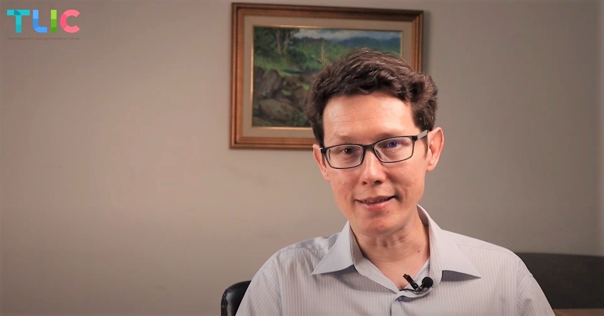

# เทคนิคการจัดองค์ประกอบของภาพ

## ⭐ แนะนำการติดตั้งและการจัดวางตำแหน่งอุปกรณ์ CMU EZ Studio & เทคนิคการจัดองค์ประกอบภาพ



## การจัดองค์ประกอบของภาพ

การจัดองค์ประกอบของภาพ 3 หัวข้อหลัก ได้แก่ **ภาพ เสียง** และ **แสง** 

1. **การจัดองค์ประกอบของภาพ** ทำได้โดยการจัดมุมกล้อง
2. **การจัดองค์ประกอบของเสียง** ทำได้โดยการจัดอุปกรณ์บันทึกเสียง
3. **การจัดองค์ประกอบของแสง** ทำได้โดยการจัดความสว่างและแสงไฟ ซึ่งจะมีหัวข้อย่อยคือ

   1.แสงสว่าง  2.เงา  3.อารมณ์ของภาพ \(Mood & Tone\) 

โดยในแต่ละหัวข้อมีรายละเอียดดังนี้

### 📷การจัดมุมกล้อง 

          การจัดมุมกล้องที่ดีนั้นควรอยู่ในระดับสายตา หรือ สูงกว่าระดับสายตาของผู้บันทึกสื่อเล็กน้อยและทำมุมกดลงมาที่ตัวผู้บันทึกสื่อ เพื่อให้เห็นตัวผู้บันทึกสื่อได้อย่างชัดเจน **ไม่ควร**จัดมุมกล้องให้อยู่ในระดับต่ำเกินไปเพราะจะทำให้ภาพที่ออกมานั้นทำมุมเสยขึ้นมา ทำให้ตัวผู้บันทึกสื่อดูใหญ่กว่าความเป็นจริง ทำให้สัดส่วนที่ได้อาจไม่พอดี และดูไม่สบายตาได้

         ทั้งนี้การมี Eye Contact ขณะบันทึกสื่อก็ถือเป็นสิ่งหนึ่งที่สำคัญ เนื่องจากจะทำให้ผู้บันทึกสื่อนั้นดูมีความเป็นมืออาชีพ ช่วยให้สื่อนั้นดูน่าสนใจมากยิ่งขึ้น

| **DO** | DON'T |
| :--- | :--- |
| ✅อยู่ในระดับสายตาหรือสูงกว่าระดับสายตาเล็กน้อย | ❌ตั้งกล้องในมุมต่ำกว่าระดับสายตา |
| ✅จัดกล้องให้อยู่ตำแหน่งกึ่งกลาง | ❌อยู่บริเวณมุมด้านใดด้านหนึ่ง |
| ✅จัดกล้องให้ทำมุมก้มลงมา | ❌จัดกล้องให้ทำมุมเสยขึ้นข้างบน |

### 🎙การจัดอุปกรณ์บันทึกเสียง  

          แม้ว่าอุปกรณ์บันทึกเสียง หรือไมโครโฟนนั้น จะสามารถดูดเสียงรอบข้างได้ดีก็ตาม แต่การจัดวางไมโครโฟนที่ดีเพื่อการบันทึกเสียงอย่างมีประสิทธิภาพนั้น ไม่ควรให้มีระยะห่างจากตัวผู้บันทึกสื่อเกิน 60 เซนติเมตร หรือ 2 ไม้บรรทัด 

          ทั้งนี้ท่านสามารถปรับระยะห่างของตัวไมโครโฟนเพื่อให้ปรากฏบนหน้าจอหรือปรับตำแหน่งเพื่อไม่ให้ตัวไมโครโฟนปรากฏบนหน้าจอได้ 

| **DO** | DON'T |
| :--- | :--- |
| ✅อยู่ใกล้ปากผู้บันทึกสื่อ \(ไม่เกิน60 CM.\) | ❌นำไมค์ห่างจากตัวผู้บันทึกสื่อเกิน 60 CM. |
| ✅ใช้ขาตั้งเพิ่มเติมเพื่อให้เคลื่อนไหวได้สะดวก | ❌พูดด้วยเสียงที่เบามาก เนื่องจากไมค์ดูดเสียงอยู่แล้ว \(การพูดเบาเกินไปอาจทำให้คุณภาพของเสียงแย่ลง\) |

### 💡การจัดแสง 

          แสงไฟหรือความสว่าง ถือเป็นหัวใจสำคัญของการบันทึกสื่อให้มีความสวยงาม น่าสนใจ  ปริมาณแสงที่พอดีจะยิ่งทำให้สื่อของท่านมีความเป็นมืออาชีพและดูสวยงามมากยิ่งขึ้น  สิ่งสำคัญในการจัดแสงไฟนั้นมี 3 เรื่องหลักที่ต้องคำนึงถึง ได้แก่ แสงสว่าง เงา และ อารมณ์ของภาพ \(Mood & Tone\) โดยในแต่ละหัวข้อนั้นมีรายละเอียดดังนี้

#### 1.แสงสว่าง

         ในชุดอุปกรณ์ CMU EZ Studio นั้น มีแสงไฟ Ring Light ที่ช่วยเพิ่มความสว่างในกับสื่อของท่านอย่างเพียงพอ โดยตำแหน่งที่แนะนำในการจัดวางตำแหน่งแสงไฟ Ring Light คือ บริเวณด้านข้างของตัวผู้บันทึกสื่อ เนื่องจาก**เป็นตำแหน่งที่ให้ความสว่างให้กับผู้บันทึกสื่อได้มากที่สุด** ช่วยเพิ่มความสว่างให้กับใบหน้าและลำตัวของผู้บันทึกสื่อได้เป็นอย่างดี ทั้งนี้ท่านสามารถปรับเปลี่ยนมุมของแสงที่ตกกระทบตัวผู้บันทึกสื่อ เพื่อเพื่อเพิ่มมิติ และ โทนของภาพหรือสื่อที่ออกมาได้ 

| **DO** | DON'T |
| :--- | :--- |
| ✅ตั้ง Ring Light ให้ใกล้ตัวผู้บันทึกสื่อมากที่สุด | ❌ตั้ง Ring Light ไว้ค่อนข้างไกลจากตัวผู้บันทึกสื่อ |
| ✅ปรับขาตั้ง Ring Light ให้พอดีเพื่อให้แสงไฟตกกระทบตัวผู้บันทึกสื่อได้มากที่สุด | ❌ปรับขา Ring Light ตั้งต่ำหรือสูงเกินไป |
| ✅แสงสว่างที่เพียงพอ  | ❌ปรับความสว่างน้อยเกินไป  |

### 

#### 2.เงา 

          ในการบันทึกสื่อการเรียนการสอนนั้น พื้นหลังก็เป็นอีกสิ่งหนึ่งที่ไม่ควรมองข้าม มีข้อควรระวังคือระวังอย่าให้มีเงาของผู้บันทึกสื่อตกกระทบกับฉากหลัง ท่านสามารถเลี่ยงได้โดยการเว้นระยะห่างจากฉากหลังประมาณ 1 เมตร หรือ หากมีข้อจำกัดในด้านสถานที่ สามารถปรับแสงไฟให้สูงและมุมก้มลงมาเพื่อไม่ให้เงาของผู้บันทึกสื่อตกกระทบฉากหลัง   

          สามารถเปลี่ยนฉากหลักให้เป็นสถานที่ต่างๆได้โดยการใช้ green Screen ซึ่ง Green Screen นั้น ไม่จำเป็นต้อง ทาผนังสีเขียว หรือใช้ Green Screen แบบสำเร็จรูปซึ่งจะมีราคาค่อนข้างสูง แต่ท่านสามารถประยุกต์ใช้จาก ผ้าสีเขียว หรือ กระดาษสีเขียวได้ 

| **DO** | DON'T |
| :--- | :--- |
| ✅อยู่ห่างจากพิ้นหลังอย่างน้อย 1 เมตร | ❌อยู่ติดกับฉากหลังทำให้มีเงาตกกระทบ |
| ✅ใช้ Green Screen เพื่อเปลี่ยนพื้นหลังให้เป็นสถานที่ต่างๆที่น่าสนใจ | ❌ฉากหลังที่ค่อนข้างรก |
| ✅จัดการฉากหลังให้สะอาด เรียบร้อย มีความน่าสนใจโดยไม่ต้อง ใช้ Green Screen |  |

### 

#### 3.อารมณ์ของภาพ\(Mood & Tone\) 

          TLIC จะขอกล่าวถึงการสร้างอารมณ์ภาพ หรือ Mood & Tone ที่เป็นที่นิยม  2 แบบ ได้แก่ 2 แบบ Cinematic และ แบบ Aura

#### Cinematic เน้นตัวผู้พูดให้ดูเด่นขึ้นมา

          โดยจะทำให้พื้นหลังมืด และสาดแสงไปที่ตัวผู้พูดเพื่อให้ผู้พูดเด่นขึ้นมา  โดยอาจปิดไฟในห้อง หรือ ใช้ Green Screen ในการนำฉากหลังสีทึบหรือสีมืดมาใส่แทน จะช่วยให้ผู้พูดดูเด่นขึ้นมา ให้อารมณ์ภาพแบบสุขุม นุ่มลึก เท่ และดูน่าค้นหาเป็นต้น

#### Aura เน้นความสว่างของทุกส่วนในวิดิโอ

          วิธีนี้จะเน้นความสว่างของทั้งตัวผู้พูดและฉากหลัง โดยจะเหมาะกับการใช้ฉากหลังที่มีความเป็นระเบียบเรียบร้อย สะอาดตา ไม่รกรุงรัง จะช่วยให้สื่อของท่านดูน่าสนใจมากขึ้นเช่นกัน จะเห็นได้ว่าภาพที่ได้นั้นจะดูสดใส สะอาด สบายตา เรียบร้อย นุ่มนวล เป็นต้น

#### **วิธีการจัดแสงไฟสำหรับอารมณ์ภาพในแบบต่างๆ เพิ่มเติม**

ท่านสามารถศึกษาข้อมูลเพิ่มเติมเกี่ยวกับวิธีการจัดไฟในรูปแบบต่างๆ โดย **Parker Walbeck** ผู้เชี่ยวชาญด้านการสร้างภาพยนตร์และการถ่ายภาพ ซึ่งแบ่งเทคนิคการจัดไฟไว้ 5 รูปแบบคือ



#### 1.Flat Lighting 

         การใช้แสงไฟส่องเข้าโดยตรงที่ใบหน้า ทำให้ไม่เกิดเงาที่ส่วนใดเลยของใบหน้า มักใช้เมื่อต้องการเน้นรายละเอียดบนผิวหน้าโดยเฉพาะ

#### 2.Paramount Lighting \(ฺButerrfly Lighting\)

         การจัดไฟมุมสูง เพื่อให้เกิดเงาใต้จมูกคล้ายรูปผีเสื้อ ซึ่งมีข้อควรระวังในการจัดตำแหน่ง หากจัดตำแหน่งสูงเกินไปจะทำให้เกิดเงาในส่วนของคิ้วที่ตกกระทบมาที่ดวงตาทำให้เกิดเป็นตาแรคคูนหรือตาแพนด้าได้ หรือหากจัดตำแหน่งแสงไฟไว้ต่ำเกินไปจะทำให้เงาบริเวณใต้คางและใต้จมูกหายไป

#### 3.Loop Lighting 

         การวางตำแหน่งไฟให้เกิดเงาลักษณะวงกลมจากปีกจมูกมาตกลงบนแก้ม\(ตามภาพ\) ช่วยให้ใบหน้ามีรูปทรงที่ยาวและเรียวมากขึ้น

#### 4.Rembrandt Lighting 

         การจัดแสงหลัก\(Key Light\)ให้เฉียงไปด้านข้างด้านใดด้านหนึ่งของใบหน้าประมาณ 45 องศา ทำให้เงา Loop Light ที่ปีกจมูกขยับไปรวมกับเงาที่บริเวณแก้มด้านข้าง ทำให้เกิดเงารูปทรงสามเหลี่ยมบริเวณใต้ดวงตา\(ตามภาพ\) เป็นรูปแบบแสงที่นิยมใช้กันมากในวงการภาพยนตร์ ช่วยให้เกิดมิติบนใบหน้าได้ถึง 3 จุดในการจัดแสงครั้งเดียว

#### 5.Split Lighting

         การขยับแสงหลักไปด้านข้างของใบหน้า 90 องศา ทำให้ใบหน้าด้านข้างด้านใดด้านหนึ่งเกิดเงาโดยสมบูรณ์ \(หรือก็คือใบหน้าข้างหนึ่งสว่าง อีกข้างหนึ่งมืด\) เหมาะสำหรับโทนภาพที่ต้องการอารมณ์เข้มแข็ง รุนแรงของเพศชาย ซึ่งแตกต่างจาก Paramount Lighting ที่จะให้โทนภาพสื่อถึงอารมณ์นุ่มนวลของเพศหญิง

