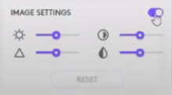

# Logitech Capture

## ⭐ แนะนำ Logitech Capture

          โปรแกรมบันทึกและสร้างสื่อการเรียนการสอนที่นิยมใช้ในปัจจุบันนั้นมีข้อดีและข้อจำกัดที่แตกต่างกันออกไป ในบางโปรแกรมที่ใช้งานง่ายมากก็อาจจะมีความสามารถที่จำกัดไปด้วย เช่น Power Point Recorder ที่มีข้อจำกัดในด้านของการกัดพื้นหลัง การลดเสียงรบกวน และ สลับแหล่งภาพระหว่างวิดิโอของผู้บันทึกสื่อกับสื่อการเรียนการสอนเป็นต้น  หรือในบางโปรแกรมที่สามารถใช้งานได้หลากหลายฟังก์ชั่นและมีความเป็นมืออาชีพสูง เช่น OBS Studio ก็อาจจะต้องแลกกับการใช้งานที่ยาก ใช้เวลาในการเรียนรู้ที่ค่อนข้างนาน 

          **Logitech Capture** จึงถือเป็นโปรแกรมที่ตอบโจทย์ในเรื่องของความสามารถในการบันทึกสื่อและการใช้งานที่ไม่ยากจนเกินไปสามารถเรียนรู้ได้ง่าย  **Logitech Capture** จึงเป็นโปรแกรมที่**เป็นที่นิยมที่สุด**ในการบันทึกสื่อการเรียนการสอน 

### ทำความรู้จัก **Logitech Capture** ได้จากคลิปวิดิโอนี้

```text
Video Preview 1 
วิดิโอ 01 Logitech capture intro and UI tour
```

### ทดลองบันทึกวิดิโอด้วย Logitech Capture และ ใช้งานร่วมกับ CMU EZ Studio Controller Version 3.0



## เริ่มต้นการใช้งาน Logitech Capture

### ทำความรู้จัก Scene 1 และ Scene 2

          การกำหนด Scene 1 และ Scene 2 นั้นเป็นสิ่งสำคัญในการบันทึกสื่อโดยใช้ Logitech Capture เพื่อให้มีความลื่นไหลในการสลับ Scene หรือ สลับเนื้อหาที่กำลังกล่าวถึง ทำให้สื่อของท่านมีความน่าสนใสและดูเป็นมืออาชีพมากยิ่งขึ้น  การกำหนด Scene หลัก หรือ Scene ที่ 1 นั้น โดยปกติมักจะกำหนดให้เป็นกล้อง Webcam ที่สามารถบันทึกใบหน้าของผู้สอน  ส่วน Scene รอง หรือ Scene ที่ 2 นั้น มักจะกำหนดเป็นสื่อการเรียนการสอนที่เตรียมไว้เช่น รูปภาพงานนำเสนอ หรือวิดิโอประกอบการเรียนการสอน เป็นต้น 

         โดยเมื่อทำการกำหนด Scene 1 และ Scene 2 เรียบร้อยแล้ว  ก็จะสามารถจัดการรูปแบบในการแสดงผลได้ทั้งหมด 6 รูปแบบด้วยกัน ดังภาพด้านล่าง


### รูปแบบในการแสดงผล  Scene 1 และ Scene 2 ทั้งหมด 6 รูปแบบ

#### รูปแบบที่ 1 : Scene 1 แสดงผลจากกล้องที่กำลังบันทึกใบหน้าของผู้สอน


#### รูปแบบที่ 2 : Scene 2 แสดงผลสื่อการเรียนการสอนที่เตรียมไว้


#### รูปแบบที่ 3 : Scene 2 เป็น Scene หลัก และ แสดง Scene  1 ประกอบบริเวณมุมซ้ายล่าง


#### รูปแบบที่ 4 : Scene 1 เป็น Scene หลัก และ แสดง Scene  2 ประกอบบริเวณมุมซ้ายล่าง


#### รูปแบบที่ 5,6 : แสดงทั้ง 2 Scene สลับด้านซ้ายและด้านขวา


## แถบเครื่องมือต่างๆ ของ Logitech Capture


1. **การตั้งค่าแหล่งที่มาของสื่อแหล่งที่ 1 \(Scene 1\)** โดยจะมีการตั้งค่าในส่วนย่อยต่างๆดังนี้

   1. Source 1  2. Priority  3. Field of View  4. HDR  5. Zoom  6. Auto Focus  7.Auto White Balance  

       8. Image Setting  9.Anto-Flicker  10. Chroma Key  11. Advanced Setting

2. **การตั้งค่าแหล่งที่มาของสื่อแหล่งที่ 2 \(Scene 2\)** โดยจะมีการตั้งค่าในส่วนย่อยต่างๆดังนี้
   1. Source 2  2. Logitech Cameras  3. Screen Capture  4. Window Capture  5.Advanced Setting
3. **การตั้งค่าเพิ่มเติม** มีการตั้งค่าในส่วนย่อยต่างๆดังนี้
   1. Watermark  2. Text Overlay  3.Scene Effects
4. **การตั้งค่ากล้อง \(Webcam\)** มีการตั้งค่าในส่วนย่อยต่างๆดังนี้
   1. Resolution  2. FPS  3.Video Encoder  4.Media Files Location  5.Advanved Setting
5. **การตั้งค่าเสียง \(Microphone\)**
6. **การตั้งค่าปุ่มลัด**
7. **การตั้งค่าโปรไฟล์เพื่อบันทึกการตั้งค่าทั้งหมด**

 

### 1. การตั้งค่าแหล่งที่มาของสื่อแหล่งที่ 1 \(Scene 1\)

#### **1.1 Source 1 หรือ แหล่งที่มาของสื่อ**

ไปที่ส่วน Dropdown List ของ Source 1 เพื่อทำการเลือกสื่อที่จะแสดงผลใน Source 1 แบ่งเป็น 3 ส่วนหลักคือ

      **Logitech Cameras** ระบบจะแสดงชื่อกล้องทั้งหมดที่ท่านมีในตัวเครื่องของท่าน \(แนะนำให้เลือก Logitech C922\)

      **Screen capture** \(เหมาะสำหรับกรณีที่ต้องการเปิดหลายโปรแกรม\) ระบบจะบันทึกทุกโปรแกรมที่ท่านเปิดไว้ บนหน้าจอของท่าน ในกรณีที่ท่านมี 2 หน้าจอ จะมีตัวเลือกให้ท่านเลือก Display 1 และ Display 2 แต่หากท่านมีเพียง 1 หน้าจอท่านสามารถเลือก Display 1 ได้เลย 

      **Window Capture** \(เหมาะสำหรับกรณีที่ต้องการเปิดโปรแกรมเดียว เช่น เปิด Power Point 1 โปรแกรม\) ระบบจะบันทึกโปรแกรมที่ท่านเลือกจากรายการโปรแกรมที่ปรากฏในส่วนนี้ โดยท่านจะต้องทำการเปิดโปรแกรมที่ต้องการไว้ก่อนระบบจึงจะแสดงให้ท่านเลือก


#### **1.2 Priority จะมีให้เลือก 2 หัวข้อดังนี้** 

      **Frame Rate** จะเป็นการเน้นความเสถียรของภาพ ให้มีความลื่นไหล \(แนะนำให้เลือก Frame Rate\)

      **Exposure** จะเป็นการเน้นเรื่องความสว่างของภาพ


#### **1.3 Filed of View**

      เป็นการกำหนดพื้นที่ที่จะทำการบันทึก  โดยในส่วนนี้จะขึ้นอยู่กับกล้องแต่ละรุ่นว่ามีตัวเลือกให้เลือกมากน้อยเพียงใด ดังตัวอย่างจะมีให้เลือก 3 องศาด้วยกัน ได้แก่ 65°, 78° และ 90° จะเห็นได้ว่า Filed of View 78° นั้นยังแสดงให้เห็นส่วนฉากหลังที่ Green Screen ปิดไม่มิด  ดังนั้น ตัวเลือกที่เหมาะสมคือ Filed of View 65° ดังภาพด้านล่าง  

      อย่างไรก็ตาม การเลือก Filed of View ที่ดีนั้นควรเลือกแบบที่เหมาะสมกับสื่อของท่านเอง


#### **1.4 HDR \(**High Dynamic Range\)

      เปิดเพื่อให้สื่อของท่านดูสมจริงและเป็นธรรมชาติมากขึ้น \(แนะนำให้ปิดเนื่องจากอาจทำให้คอมพิวเตอร์ของท่านใช้ทรัพยากรมากเกินจำเป็นได้\)

####  **1.5 Zoom**

      สามารถปรับกรอบภาพของท่านได้โดยการกด Zoom ซึ่งจะตัดกรอบภาพบริเวณโดยรอบของท่านออก ท่านสามารถปรับตำแหน่งเพิ่มเติมได้โดยการกดลูกศรบริเวณซ้ายมือ


#### **1.6 Auto Focus**

การตั้งค่า Auto Focus แนะนำให้ทำการปิดฟังก์ชันนี้ไว้ เนื่องจากการ Auto Focus ในบางครั้งเมื่อหลุดโฟกัส ตัวกล้องจะพยายามจับโฟกัส ทำให้เกิดเป็นภาพเบลอ สลับกับภาพชัด สลับไปมาระหว่างบันทึกสื่อได้


#### **1.7 Auto White Balance**

ในส่วนนี้จะเป็นการปรับความสว่างของภาพ โดยเมื่อปรับไปฝั่งซ้ายภาพจะเป็นโทนสีฟ้า ฝั่งขวาจะเป็นโทนสีส้ม สามารถปรับได้ตามความเหมาะสม


#### **1.8 Image Setting**

เป็นการปรับในส่วนของปลายสัญญาณภาพ หรือ \(ไม่ใช้การปรับที่ตัวกล้อง\) สามารถปรับ Brightness, Contrast, Sharpness และ Saturationได้ แต่ไม่ควรปรับมากจนเกินไปแนะนำให้ปล่อยเป็นค่าเริ่มต้นไว้ หากปรับมากเกินไปจะทำให้ภาพที่ได้ไม่คมชัด และ ไม่เป็นธรรมชาติ



#### **1.9 Auto-Flicker**

ความถี่ของไฟที่ใช้ในประเทศไทย แนะนำให้ใช้ 50 HZ เพื่อทำให้ภาพไม่สั่น


#### **1.10 Chroma key**

การกัดพื้นหลัง มีให้เลือก 2 สี ได้แก่ สีเขียว และ สีน้ำเงิน เมื่อเลือกสีเรียบร้อยแล้วจะต้องทำการตั้งค่าส่วนของ Threshold แลt Smoothness เพิ่มเติม เพื่อกัดพื้นหลังให้เรียบเนียนยิ่งขึ้น


เมื่อตั้งค่า Chroma key ****เรียบร้อยจะได้ผลลัพธ์การกัดพื้นหลังดังภาพด้านล่าง


#### **1.11 Advanced Setting**

จะเป็นการตั้งค่ากลับภาพในแนวตั้ง หรือ Vertically Flip Source และ แนวนอน หรือ Horizontally Flip Source


### 2. การตั้งค่าแหล่งที่มาของสื่อแหล่งที่ 2 \(Scene 2\)

ในส่วนนี้จะแบ่งเป็น 3 ส่วนหลักเช่นเดียวกับการตั้งค่าแหล่งที่มาของสื่อแหล่งที่ 1 \(Scene 1\) ในข้อ 3 โดยสื่อที่ได้ทำการเลือกสื่อแหล่งที่ 1 \(Scene 1\) จะใช้เป็นกล้อง **Logitech Cameras**  ดังนั้นการตั้งค่าแหล่งที่มาของสื่อแหล่งที่ 2 \(Scene 2\) จะเลือกเป็น **Screen capture** หรือ  **Window Capture** ตามความต้องการของท่าน

      **Screen capture** \(เหมาะสำหรับกรณีที่ต้องการเปิดหลายโปรแกรม\) ระบบจะบันทึกทุกโปรแกรมที่ท่านเปิดไว้ บนหน้าจอของท่าน ในกรณีที่ท่านมี 2 หน้าจอ จะมีตัวเลือกให้ท่านเลือก Display 1 และ Display 2 แต่หากท่านมีเพียง 1 หน้าจอท่านสามารถเลือก Display 1 ได้เลย 

      **Window Capture** \(เหมาะสำหรับกรณีที่ต้องการเปิดโปรแกรมเดียว เช่น เปิด Power Point 1 โปรแกรม\) ระบบจะบันทึกโปรแกรมที่ท่านเลือกจากรายการโปรแกรมที่ปรากฏในส่วนนี้ โดยท่านจะต้องทำการเปิดโปรแกรมที่ต้องการไว้ก่อนระบบจึงจะแสดงให้ท่านเลือก


### 

### **3. การตั้งค่าเพิ่มเติม** 

แบ่งเป็นการตั้งค่าในส่วนย่อยต่างๆดังนี้

**3.1 Watermark**  สามารถเปิดปิด Watermark หรือลายน้ำของ Logitech Capture ได้

**3.2 Text Overlay**  การตั้งค่าข้อความ ให้ปรากฏบนจอของท่าน โดยท่านสามารถกำหนดข้อความ ระยะเวลาแสดงข้อความ ขนาด สีข้อความ และ พื้นหลังข้อความ ได้  เช่น เพิ่มข้อความที่แสดงหัวข้อหรือเรื่องที่จะทำการสอน เป็นต้น


**3.3 Scene Effects** ในส่วนนี้จะเป็นการแต่งภาพ แต่ไม่แนะนำให้เปิดเนื่องจากการทำสื่อการเรียนการสอนจะเน้นในเรื่องของความสมจริงเป็นหลัก และ อาจทำให้ความคมชัดของภาพลดลง


### 

### 4. การตั้งค่ากล้องวิดีโอ \(Webcam\)

         แบ่งเป็น **5 ส่วนหลัก** ดังนี้ **1. Resolution  2. FPS  3. Video Encoder**  **4. Media Files Location** และ              **5. Advanced Setting**


**4.1 Resolution** หรือความละเอียดในการแสดงผลภาพ คือส่วนที่สำคัญที่สุดเลยก็ว่าได้ แบ่งเป็น 3 รูปแบบคือ

1. **Landscape** หรือการทำวิดิโอแบบแนวนอนซึ่งเป็นแบบที่นิยมที่สุดในปัจจุบัน เนื่องจากสามารถนำไปใช้ได้ในหลากหลายแพลตฟอร์ม
2. **Portrait** หรือการทำวิดิโอแนวตั้ง อาจจะใช้เพื่อเอาใจผู้บริโภคสมัยใหม่ที่บริโภคสื่อผ่าน Smart phone แต่ท่านอาจจะต้องปรับสื่อประกอบการเรียนการสอนของท่านให้มีแนวตั้งด้วย
3. **Square** หรือการทำวิดิโอในรูปแบบสี่เหลี่ยมจัตุรัส

          ซึ่งความละเอียดที่แนะนำให้ใช้ คือแบบ **Full HD** เพื่อให้ได้สื่อที่มีคุณภาพสูง คมชัด  ทั้งนี้การเลือก resolution จะขึ้นอยู่กับความสามารถของคอมพิเตอร์ของท่านด้วย ว่ามีความแรงเพียงพอที่จะใช้ความละเอียดสูงได้หรือไม่ ซึ่งหากไม่เพียงพอก็อาจจะทำให้วิดิโอของท่านกระตุก ไม่ลื่นไหลได้  ท่านอาจจะต้องลดความละเอียดลงเพื่อให้สามารถบันทึกได้  แต่ TLIC ไม่แนะนำให้ลดความละเอียดต่ำจนเกินไป เพราะจะทำให้สื่อของท่านนั้นไม่คมชัดและดูไม่เป็นมืออาชีพ

**4.2 FPS** **\(Frame per sec\)** หรือ การแสดงผลจำนวนภาพต่อ 1 วินาที ยิ่งวิดิโอที่บันทึกมีการเคลื่อนไหวที่เร็วมากเท่าไหร่ การมีจำนวนเฟรมต่อวินาทีมาก จะยิ่งทำให้การแสดงภาพมีความลื่นไหล หรือไม่กระตุกนั่นเอง  แต่ในส่วนของการบันทึกสื่อการเรียนการสอนนั้น โดยในส่วนนี้ไม่จำเป็นต้องเลือก FPS สูง เนื่องจากสื่อที่บันทึกนั้นไม่ได้มีการเคลื่อนไหวที่เร็วมาก โดยแนะนำให้เลือก FPS ที่ **25 หรือ 30** ก็เพียงพอแล้ว 

**4.3 Video Encoder** หรือการเข้ารหัสวิดิโอ ในส่วนนี้ระบบจะทำการเลือกเองอัตโนมัติ 

**4.4 Media Files Location** ในส่วนนี้จะเป็นการตั้งค่าพื้นที่เก็บไฟล์วิดิโอของท่าน โดยท่านสามารถเปลี่ยนสถานที่เก็บไฟล์ได้โดยการกด **"Change"** และเลือกตำแหน่งโฟลเดอร์หรือไดร้เวอร์ที่ท่านต้องการ  รวมถึงท่านสามารถเปิดดูไฟล์ที่ท่านทำการบันทึกได้โดยการกด "**Open"** ระบบจะแสดงหน้าต่างโฟลเดอร์ที่ท่านทำการเก็บไฟล์ทั้งหมดไว้

**4.5 Advanced Setting** จะเป็นการตั้งค่ากลับภาพบนล่าง และ ซ้ายขวา โดยแนะนำให้ทำการปิดไว้


### 5. การตั้งค่าการบันทึกเสียง \(Microphone\)

ท่านสามารถเลือกไมโครโฟนที่ท่านต้องการได้ โดยระบบจะแสดงไมโครโฟนทั้งหมดที่คอมพิวเตอร์ของท่านมี


      ท่านสามารถตั้งค่าความดังเบาของเสียงไมโครโฟนและลำโพงของท่านได้ โดยปรับปุ่มรูปไมโครโฟนและลำโพง บริเวณมุมขวาล่างของหน้าจอดังภาพ  

### 6. การตั้งค่าปุ่มลัด

          ในกรณีที่ใช้ร่วมกับ **CMU** **EZ Studio Controller version ที่ 3 ไม่จำเป็นต้องทำการตั้งค่าในส่วนนี้**  สามารถเชื่อมต่อและใช้งานโดยกดปุ่มบนเครื่อง CMU EZ Studio Controller version ที่ 3 ได้ทันที 

          แต่ในส่วนของการใช้งานโดย**ไม่ใช้กล่อง CMU EZ Studio Controller** หรือ ใช้งานร่วมกับ **CMU EZ Studio Controller version 1 และ 2**  ท่านจะต้องทำการตั้งค่าปุ่มลัดเพื่อช่วยให้การควบคุมสื่อของท่านดูราบรื่น ไม่สะดุด ซึ่งสามารถตั้งค่าโดยกดปุ่ม Alt พร้อมกับ ปุ่มตัวอักษรภาษาอังกฤษตามที่กำหนด หรือ ท่านสามารถเปลี่ยนปุ่มลัดเองได้โดยการกดแก้ไข และ Alt พร้อมกับกดตัวอักษรที่ท่านต้องการ 


### 7. การตั้งค่าโปรไฟล์

        ให้ท่านทำการ Log in หลังจากนั้นระบบจะแสดงเมนู Back up เพื่อทำการบันทึกการตั้งค่าทั้งหมดที่ท่านได้ทำการตั้งค่าไว้ใน Account ของท่าน


## **เริ่มบันทึกสื่อ**

1. หากมีกล่อง CMU EZ Studio Controller สามารถเริ่มบันทึกด้วยการกดปุ่ม Record ที่กล่อง CMU EZ Studio Controller เพื่อเริ่มทำการบันทึกได้ทันที  
2. ท่านสามารถกดปุ่มลัดที่ได้ทำการตั้งค่าไว้ \(Alt + ตัวอักษรที่ท่านตั้งค่าไว้\)
3. ใช้เม้าส์กดที่ปุ่ม Record บนโปรแกรม Logitech Capture 

โดยเมื่อกดบันทึกแล้ว สถานะของปุ่ม บนโปรแกรม Logitech Capture นั้นจะเปลี่ยนจาก

                                  เป็น     

         โดยระหว่างการบันทึกนั้นหากท่านต้องควบคุมสื่อ Scene 1 และ Scene 2 ให้เป็นรูปแบบต่าง ๆ  ท่านสามารถกดปุ่ม Source 1, Source 2, A, B, C และ D บนกล่อง CMU EZ Studio Controller ได้   หากท่านใดไม่มี กล่อง CMU EZ Studio Controller ท่านก็ยังสามารถใช้ปุ่มลัดบนแป้นพิมพ์ หรือ ใช้เม้าส์กดปุ่มต่างๆบนโปรแกรม Logitech Capture ได้

## ดาวน์โหลดไฟล์คู่มือการใช้งาน Logitech Capture สำหรับใช้งานร่วมกับ CMU EZ Controller Version 1,2 ได้ที่นี่ \(.pdf\) 



## ดูวิดิโอสอนการใช้งาน Logitech Capture ร่วมกับ CMU Studio EZ Controller Version 1 และ 2 ได้ที่นี่

วิดิโอสอนการใช้งานเมนูโปรแกรม Logitech Capture มีทั้งหมด 3 Part ดังนี้







